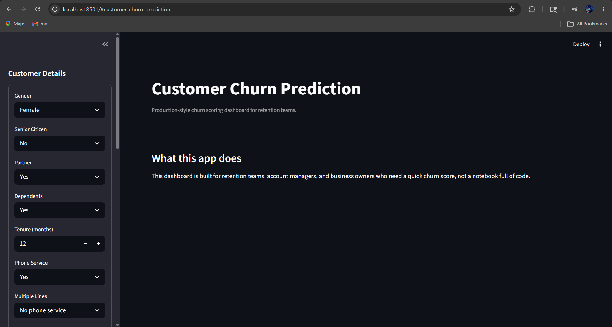
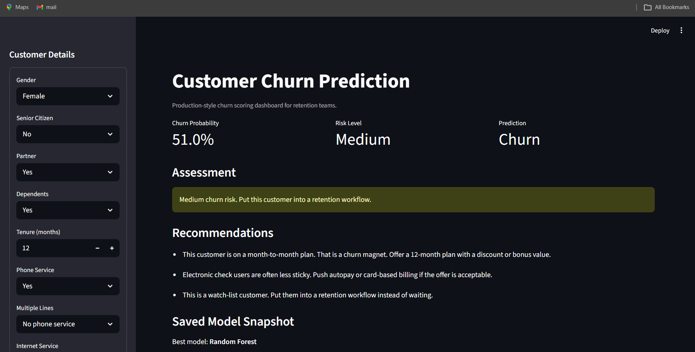
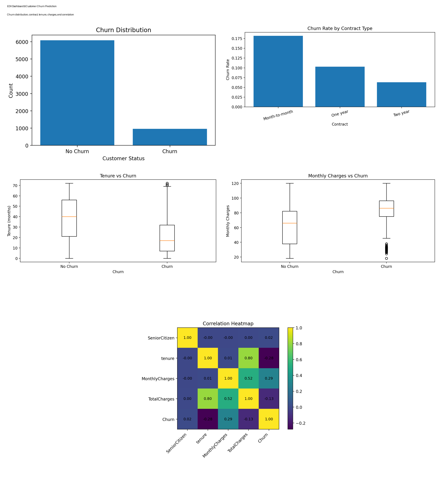

# Customer Churn Prediction

I built this project to understand how machine learning can actually help a business reduce customer loss, not just predict numbers.

Instead of treating this like a basic ML assignment, I focused on building a small end-to-end system that:
- predicts churn
- explains why customers leave
- and gives simple actions a business can take

---

## 📸 Project Preview

---

## 🧠 Problem

Customer churn is one of the biggest problems for subscription-based businesses.  
If a company can identify at-risk customers early, it can take action before they leave.

---

## ⚙️ What This Project Does

- Predicts whether a customer will churn
- Trains and compares multiple ML models
- Identifies key churn drivers
- Generates business insights
- Provides recommendations for retention
- Includes an interactive Streamlit dashboard

---

## 🧱 Tech Stack

- Python  
- pandas, numpy  
- scikit-learn  
- matplotlib, seaborn  
- Streamlit  

---

## 📊 Dataset

Telco Customer Churn dataset.

---

## 🧹 Data Preprocessing

- Fixed `TotalCharges`
- Handled missing values
- Encoded categorical variables
- Scaled features
- Avoided data leakage

---

## 📈 EDA

- churn distribution  
- churn vs contract  
- churn vs tenure  
- churn vs charges  

---

## 🤖 Models

- Logistic Regression  
- Decision Tree  
- Random Forest  

Best model selected using F1 Score.

---

## 🔑 Key Insights

- Month-to-month customers churn more  
- Low tenure = high risk  
- High charges increase churn  
- Payment method impacts retention  

---

## 💡 Product Thinking

Simple tool for:
- business teams  
- analysts  

Flow:
1. Input data  
2. Get prediction  
3. Take action  

---

## 🖥 Run Project

pip install -r requirements.txt  
python main.py  
streamlit run app/streamlit_app.py  

---

## 👤 Author

Mohit Jyani
